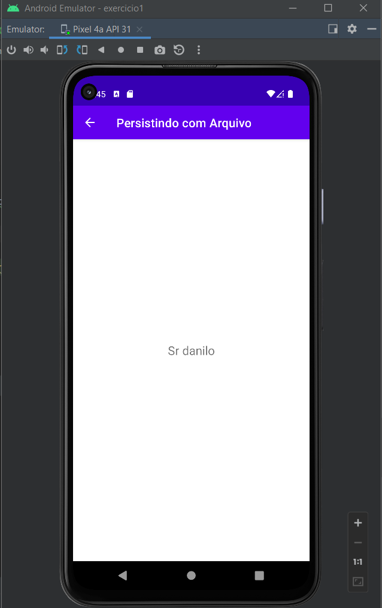

# mob-25-aplicacoes-android-aula4-exercicio3

# Utilizando o sqlite
VersionCode: 1.0

VersionName: "1"

# Introdução
Vamos utilizar o [sqlite](https://www.sqlite.org/index.html) para recuperar as informações na segunda tela

| Tela 1     | Tela 2     |  
| ------------- | ------------- |
|||

# Authors

Danilo Santos
[@danilopsnts](https://www.linkedin.com/in/danilopsnts/)