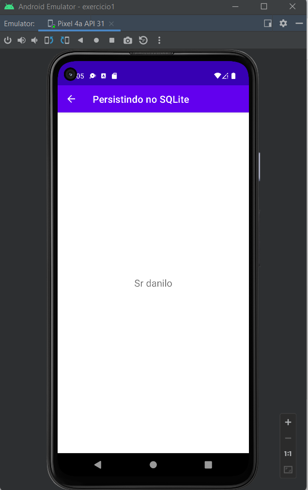

# mob-25-aplicacoes-android-aula4-exercicio2

# Persistindo em arquivos
VersionCode: 1.0

VersionName: "1"

# Introdução
Uma demonstraçao de como guardar informações entre as telas utilizando arquivos.

Para esse exemplo foram criadas duas funções, sendo: **SaudacaoActivity.recoveryFileData** e **MainActivity.saveFileData**

Essas funções tem como ojetivo recuperar e salvar informações no arquivo, para transitar entre as telas, conforme ilustrações a seguir.

| Tela 1     | Tela 2     |  
| ------------- | ------------- |
|||

# Authors

Danilo Santos
[@danilopsnts](https://www.linkedin.com/in/danilopsnts/)